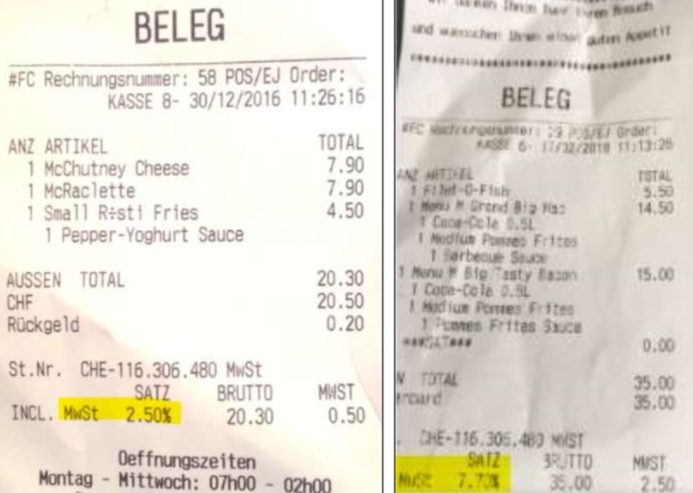
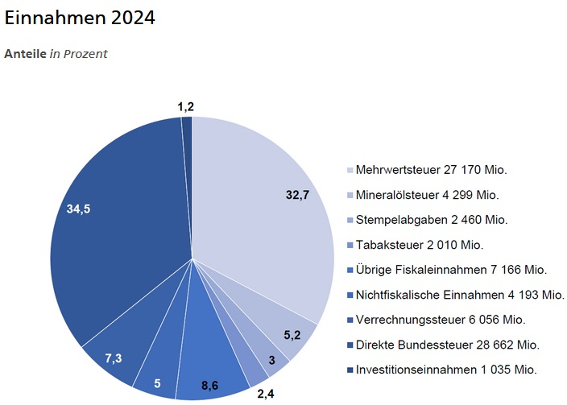

# Steuerart: Mehrwertsteuer (MWST)

## Steuer aussuchen, definieren, einordnen und abgrenzen

### Was ist die MWST?

Die MWST ist eine allgemeine **Verbrauchs- und Konsumsteuer**. Sie dient dem **Fiskalpolitischtischen** Zweck, also der **Finanzierung** des Staates. Sie wird keinen Zweck direkt, auch wenn sie bereits für mehere Zwecke benutzt wird. Sie ist die grösste Einnahmequlle des Staates.

Seit dem 01.01.2024 würden alle Steuersätze leicht erhöht, was jede Person in der Schweiz betrifft, egal ob Büger, Tourist oder Unternehmen. Jeder bezahlt die MWST automatisch, wenn er in der Schweiz konsumiert.

### Indirekt beim Kauf oder import

Die MWST wird indirekt erhoben, das heisst, dass sie nicht direkt vom Konsumenten bezahlt wird, sondern vom Verkäufer. Der Verkäufer muss die MWST an den Staat abführen. Der Konsument merkt die MWST nur, weil sie auf dem Beleg aufgeführt ist. Es gibt Ausnahmen, bei dennen die MWST nicht inkl. ist und der Konsument neben dem Produktpreis auch die MWST bezahlen muss.Eine solche Ausnahmen, wäre das Importen von Waren aus dem Ausland. Der Käufer muss die MWST und Zollgebühren bezahlen, bevor er die Ware in Empfang nehmen kann. Wenn diese Ware in der Schweiz verkauft wird, kann der Verkäufer die MWST wieder zurückfordern, damit die MWST nicht doppelt bezahlt wird.

### Wie hoch ist sie?

Die MWST besteht aus drei verschiedenen Steuersätzen:

- **Normalsatz 7.7 % (neu 8.1 %)**
  - Allgemeiner Steuersatz auf alles, dass nicht in den anderen Kategorien fällt
  - Allgemein auf "Luxusgüter"
  - **Beispiel:** PCs, Smartphones, Notebooks, Kleider, (spezifisch) Abwasserentsorgung, ...
- **Sondersatz 3.7 % (neu 3.8 %)**
  - Beherberungsleistungen, wie Unterkünfte, Hotels, ...
  - inkl. Frühstück
  - Hat den Sinn Touristen anzulocken
- **Reduzierter Satz 2.5 % (neu 2.6 %)**
  - Essen, Trinken (kein Alkohol) Medikamente, Zeitungen, Bücher, Dünger, Tiernahrung ...
  - Alltägliche Dinge, die man braucht

In Restaurants essen, gilt als Luxus und wird mit 8.1 % versteuert, deswegen gibt es die "Zum Mitnehmen"-Frage bei Take-Away Restaurants wie McDonald's. Wenn das Essen mitgenommen wird, gilt der reduzierte Satz von 2.6 %. Natrülich bleibt der Preis für den Konsumenten gleich, aber McDonald's spart ein und verweisst möglichst oft auf die Take-Away Option.

#### Steuervereinfachungen und Steuerbefreiungen

Wenn mehrere Unternehmen zusammenarbeiten, können sie sich gegenseitig Dienstleistungen erbringen. In solchen Fällen gibt es eine **Vereinfachung** bezüglich der Mehrwertsteuer (MWST). Die MWST wird nicht einfach weitergereicht, sondern nur die Differenz der MWST wird abgeführt. Das bedeutet, dass die MWST nur auf den Gewinn berechnet wird.

Kleinstunternehmen, heisst, Betriebe, die unter 100'000 Franken im Jahr erwirtschaften, sind **steuerbefreit**, aber sie können keine Vorsteuerabzüge geltend machen. Dies gilt häufig für selbstständig Erwerbende ohne Angestellte.

#### Wie viel nimmt der Staat mit dieser Steuer ein?

Die Mehrwertsteuer macht 32.7 Prozent der Einnahmen aus. Damit ist sie zusammen mit der direkten Bundessteuer die wichtigste Einnahmequelle des Bundes. Besteuert wird der inländische Konsum. Dazu zählt der Bezug von inländischen Gütern und Dienstleistungen, aber auch die Importe. Die Exporte unterliegen nicht der Mehrwertsteuer.

### Zweck der MWST

[Was soll damit erreicht werden? Prävention, Lenkung, Finanzierung, ...]
Sie wurde ursprünglich als Einnahmequelle des allgemeinen Bundeshaushaltes konzipiert, um die Staatsausgaben zu finanzieren.

Ein Prozent der Mehrwertsteuer kommt der AHV zugute. 0.1 Prozent gehen an Eisenbahngrossprojekte wie die Neat. Bis 2030 wird sie für Fonds zur Finanzierung und Ausbau der Bahninfrastruktur (Fabi) eingesetzt.

## Wer erhebt die Steuer?

Der Bund erhebt die MWST. Die Steuer wird von den Unternehmen erhoben und an den Bund abgeführt.

## Ursprung der Steuer und aktuelle Relevanz

Die MWST wurde 1995 eingeführt und ist der Nachfolger der Warenumsatzsteuer (WUSt). Die generelle Relenvanz ist offensichtlich, als die wichtigste Steuer der Schweiz.

# Quellen

- [KMU Admin.ch | 09.02.24](https://www.kmu.admin.ch/kmu/de/home/praktisches-wissen/finanzielles/steuern/mwst.html)
- [ESTV Admin.ch | 09.02.24](https://www.estv.admin.ch/estv/de/home/mehrwertsteuer.html)
  - [Einnahmen | 09.02.24](https://www.efv.admin.ch/efv/de/home/finanzberichterstattung/bundeshaushalt_ueb/einnahmen.html#-916147128)
- [SRF | 09.02.24](https://www.srf.ch/news/schweiz/mwst-initiative-wofuer-bezahlen-wir-eigentlich-die-mehrwertsteuer)
- [Weka.ch | 09.02.24](https://www.weka.ch/themen/finanzen-controlling/mehrwertsteuer/buchfuehrung-und-abrechnung/article/mehrwertsteuer-uebersicht-ueber-die-verschiedenen-mwst-saetze/)
