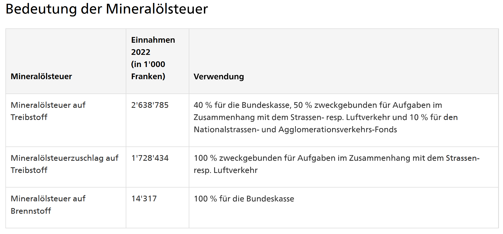

# Mineralölsteuer

## Was ist die Mineralölsteuer?

Die Mineralölsteuer ist eine spezielle Verbrauchsteuer, die auf bestimmte Mineralöle erhoben wird, darunter Benzin, Diesel, Heizöl und andere. Sie ist eine Bundessteuer in der Schweiz.

## Indirekt beim Kauf

Die Mineralölsteuer wird indirekt beim Kauf der mineralölhaltigen Produkte erhoben. Sie wird beim Verkauf durch den Verkäufer auf den Endverbraucher übertragen; heisst, der Verkäufer ist für die Zahlung der Steuer verantwortlich.

## Wer zahlt die Steuer?

Die Mineralölsteuer wird vom Verkäufer erhoben und auf den Endverbraucher übertragen. Der Verkäufer ist für die Zahlung der Steuer verantwortlich.

## Auf welchen Produkten wird die Steuer erhoben?

Die Mineralölsteuer wird auf Benzin, Diesel, Heizöl und andere Mineralöle erhoben.

## Wie hoch ist sie?

Die Steuersätze für die Mineralölsteuer variieren je nach Art des Mineralöls:

| Mineralöl           | Steuersatz   |
| ------------------- | ------------ |
| unverbleites Benzin | 76,82 Rappen |
| Dieselöl            | 79,57 Rappen |
| Heizöl extraleicht  | 0,3 Rappen   |

### Wie viel nimmt der Staat durch Mineralölsteuern ein?

Im Jahr 2022 bewirkte die Mineralölsteuer 7,6 % der Bundeseinnahmen in der Schweiz.

### Gibt es Steuererleichterungen und / oder Steuerbefreiungen?

Mineralöle können unversteuert gelagert werden, und es gibt spezifische Regelungen für bestimmte Anwendungen, die zu Steuererleichterungen oder -befreiungen führen können.

## Wer erhebt die Steuer?

Die Mineralölsteuer wird auf Bundesebene erhoben; eine besondere Verbrauchsteuer.

## Zusätzliche Informationen

- Das Heizöl wird beim Import in der Schweiz rötlich eingefärbt
