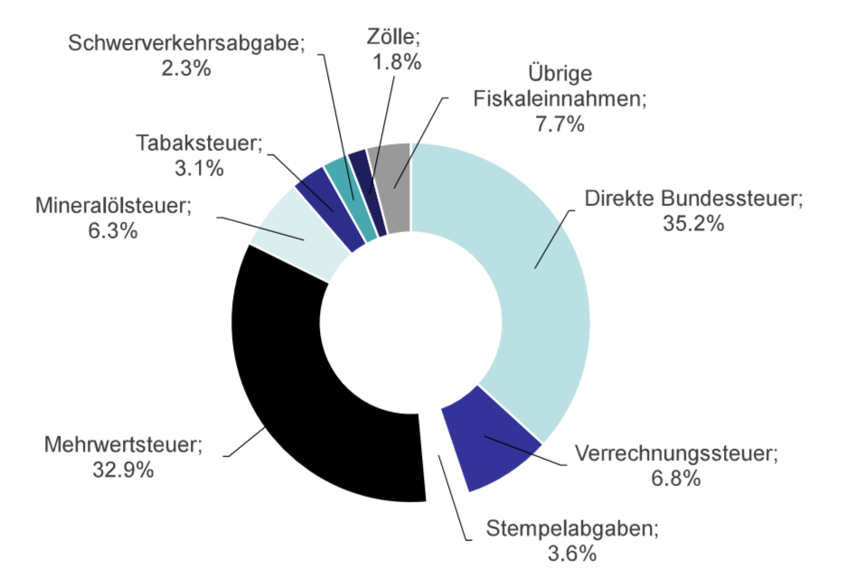

# Steuern in der Schweiz - Eidg. Steueramt in Bern, MWST Steuerrevisor

## das schweizerische Steuersystem

Die Schweiz sind in 26 Kantone eingeteilt. Ein Staat wird in 26 kleine Staaten eingeteilt. Gemeinden werden tendenziel weniger, weil sie sich fusionieren. So sparen sie kosten, in dem sie die Infrastuktur teilen.
  
Es gibt Steuern, welche nur bestimmte Stufen erheben dürfen z.B. MWST wird nur vom Bund erhoben

### Steuern beim Bund

#### Direkte Steuern

**Beispiel:** Einkommensteuer, Person x schuldet es dem Bund und diese trägt sie

- Direkte Bundessteuer
  - Einkommensteuer -> die Lohnsteuern vom Bund
- Wehrpflichtersatzabgabe
  - Wehrpflichtig ist der Mann, der schweizer Bürger ist
  - Dienstpflichtige (Männer), welche untauglich sind, müssen zahlen; sie tragen sie - 3 % relativ hoch

#### Indirekte Steuern

**Beispiel:** MWST, Person x zahlt die Steuer für den Laden, er trägt diese, aber der Laden liefert diese aus

### Steuern bei Kantonen & Gemeinden

Kantone kennen Erbschaftsteuern, Gemeinde nicht.

Schenkungssteuern, wenn der verschenkt wird, muss man Steuern zahlen; Luzern kennt diese nicht, aber man darf nicht innerhalb von 5 Jahren sterben, sonst wird es zu einer Erbschaftssteuer.  
So kann man in Luzern seinen Erben Geld schenken und man _nach_ 5 Jahren stirbt, wird nichts verschuldet.

#### Kanton

##### Direkte Steuern

- Vermögen- & Einkommensteuern

##### Besitz- und Aufwandsteuern

- Wenn man ein Auto besizt, zahlt man Motorfahrzeugsteuern
- Hundesteuer (Besitzt und MWST für das Fressen)
  - Ausnahmen: Bauern und Blidenführer Hunde
  - Hunde die einen Zweck erfüllen, sind von Steuern befreit
  - _(Katzen werden diskriminiert)_
- Lotteriesteuer

### Steuereinnahmen

#### vom Bund

#### vom Kanton

### Wozu zahlen wir Steuern

**Für die Infrastruktur**

## Tagebuch eines Steuerzahlers

Hier ein Beispiel, dass aufzeigt, dass Steuern uns überall und alltäglich begegnen.

[Tagebuch eines Steuerzahlers](./Tagebuch%20eines%20Steuerzahlers.md)
