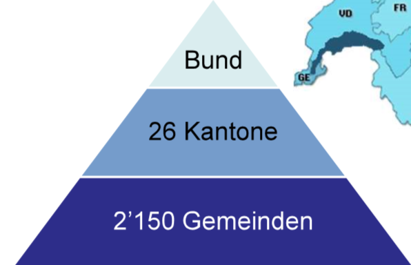
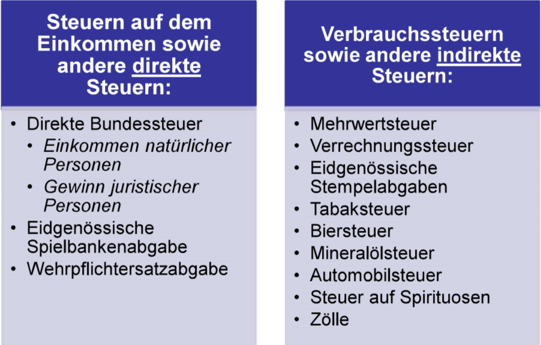
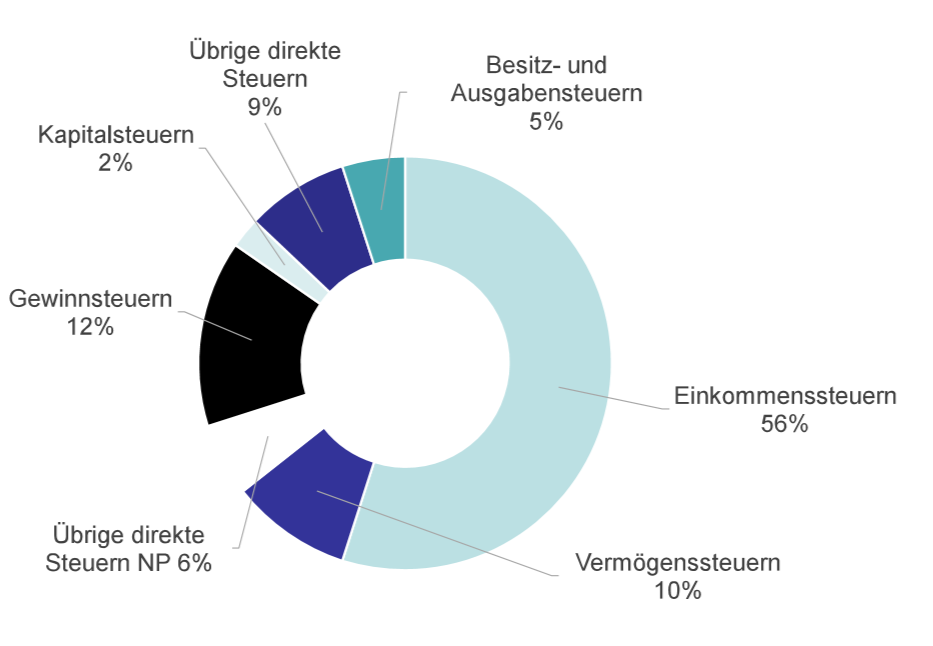

# Steuern in der Schweiz - Eidg. Steueramt in Bern, MWST Steuerrevisor

## das schweizerische Steuersystem

Die Schweiz sind in 26 Kantone eingeteilt. Ein Staat wird in 26 kleine Staaten eingeteilt. Gemeinden werden tendenziel weniger, weil sie sich fusionieren. So sparen sie kosten, in dem sie die Infrastuktur teilen.
  
Es gibt Steuern, welche nur bestimmte Stufen erheben dürfen z.B. MWST wird nur vom Bund erhoben

### Steuern beim Bund

#### Direkte Steuern

**Beispiel:** Einkommensteuer, Person x schuldet es dem Bund und diese trägt sie

- Direkte Bundessteuer
  - Einkommensteuer -> die Lohnsteuern vom Bund
- Wehrpflichtersatzabgabe
  - Wehrpflichtig ist der Mann, der schweizer Bürger ist
  - Dienstpflichtige (Männer), welche untauglich sind, müssen zahlen; sie tragen sie - 3 % relativ hoch

#### Indirekte Steuern

**Beispiel:** MWST, Person x zahlt die Steuer für den Laden, er trägt diese, aber der Laden liefert diese aus

### Steuern bei Kantonen & Gemeinden

Kantone kennen Erbschaftsteuern, Gemeinde nicht.

Schenkungssteuern, wenn der verschenkt wird, muss man Steuern zahlen; Luzern kennt diese nicht, aber man darf nicht innerhalb von 5 Jahren sterben, sonst wird es zu einer Erbschaftssteuer.  
So kann man in Luzern seinen Erben Geld schenken und man _nach_ 5 Jahren stirbt, wird nichts verschuldet.

#### Kanton

##### Direkte Steuern

- Vermögen- & Einkommensteuern
-

##### Besitz- und Aufwandsteuern

- Wenn man ein Auto besizt, zahlt man Motorfahrzeugsteuern
- Hundesteuer (Besitzt und MWST für das Fressen)
  - Ausnahmen: Bauern und Blidenführer Hunde
  - Hunde die einen Zweck erfüllen, sind von Steuern befreit
  - _(Katzen werden diskriminiert)_
- Lotteriesteuer

### Steuereinnahmen

#### vom Bund

#### vom Kanton

### Wozu zahlen wir Steuern

**Für die Infrastruktur**

## Quiz "Tagebuch eines Steuerzahlers"

[Tagebuch eines Steuerzahlers](./Tagebuch%20eines%20Steuerzahlers.md)

# Die Mehrwertsteuer

Man selbst ihr MWST-Pflichtig, wenn alles der folgenden Eintrifft:

- Sonderfall: Zollschuldner -> Zolle auf Gegenstände aus dem Ausland

## MWST: Steuersätze

- **Normalsatz 7.7 % (neu 8.1 %)**

- **Sondersatz 3.7 % (neu 3.8 %)**
- Beherberungsleistungen
- Unterkunft einschliesslich Frühstück

  - Soll Touristen anloken

- **Reduzierter Satz 2.5 % (neu 2.6 %)**
- Ess- und Trinkwaren ohne Alkohol
- Medikamente, Zeitungen, Bücker etc.
  - Altägliche Sachen nicht allzu stark zu versteuern

Sie müssen Essen, Coop ist billig; Restaurant ist Luxus und wird mit 8.1 % versteuert.
Im MCDonald's wird gefragt, ob es Zum Mitnehmen oder Hier essen ist. **Diese Frage ist für den Steuersatz**

- 2.5 % zum Mitnehmen
- 8.1 % zum Hier essen
- (Der Preis ist natürlich immer derselbe)
  

# Einkommensteuer

## Steuerbelstungen (Bund/Kanton)

**Einkommensteuer:**  
Zwei Personen zählen als ein Subjekt, wenn sie verheiratet sind, daher solten zwei arbeitende Paare niemals heiraten.

Steuern varrieren je nach Gemeinde

- 1.6 Steuerfuss -> Vorgabe vom Bund. Steuern varrieren vom Bund. Tiefe Steuern wollen Leute anlocken, dann wollen alle dort hin und die Mieten steigen und machen mehr gewinn.
- 1.4 Kirchensteuerfuss
- Gemeindesteuerfuss ist variabel und hängt von Kanton ab.

| Gemeinde  | Steuerfuss | Steuerrechnung |
| --------- | ---------- | -------------- |
| Luzern    | 3.55       | 15'563         |
| Ebikon    | 3.75       | 16'440         |
| Entlebuch | 4.1        | 17'974         |
| Meggen    | 2.7455     | 12'036         |

[Einkommensteuertraif Luzern](Internetlink)

## Beginn und Ende der Steuerpflicht

Sobald ein Kind ein eigenes Erwerbseinkommen hat, muss eine Steuererklärung ausgefüllt werden.
**Wann muss man ein Steurerklärung ausfüllen?**

## Steuererklärung

Ausnahmen:

- Sold (Taggeld z.B. Militärgeld)
- Kapitalgewinn (Konsole kaufen für 1000 und für 1500 verkaufen; nur wenn es einmalig bzw. seltener ist)
- Aktien werden auch nicht versteuert (ausser die Dividenen der Aktien)

### Was kann man abziehen?

#### Gewinnungskosten

- Alle Kosten, welche für die Arbeit aufkommen
  - Bilette, Verpflegung,...
  - Man kann 15 Franken jeden Tag abziehen

#### Allgemine Abzüge

- Paulschallen, Versicherungsprämien

#### Sozialabzüge

- Kinderabzug
- Verheiratenabzug

### Einreichung

TBA

### Auskunftspflicht

TBA

### Zahlunspflicht

TBA
