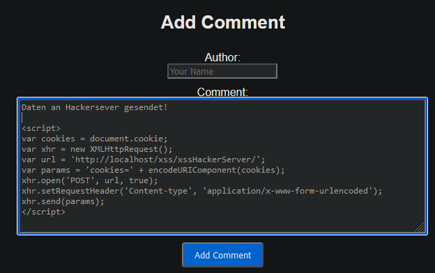
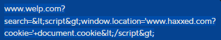
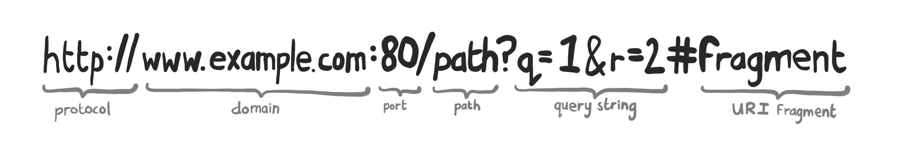
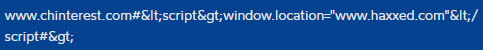

# Cross-Site Scripting

## Cross-Site Scripting (XSS)

Cross-Site Scripting (XSS) ermöglicht es Skripte in Webseiten einzufügen, die bei anderen Benutzern ausgeführt werden. Die grösste Anlaufstelle für XSS-Angriffe sind Webanwendungen, die Benutzereingaben nicht ausreichend validieren oder filtern, da XSS-Skripte in der Regel in Input-Felder oder URLs eingefügt werden. Dadurch, dass die Skripte im Browser des Benutzers ausgeführt werden, können sie auf Cookies, Sitzungen und andere vertrauliche Informationen zugreifen. Die Folgen sind selbsterklärend.

### Beispiel

Ein Angreifer könnte bösartigen JavaScript-Code in ein Kommentarfeld einer Blog-Website einschleusen. Wenn ein anderer Benutzer die Seite besucht und der Kommentar gerendert wird, wird der Code im Browser des Benutzers ausgeführt.

#### Beispielcode



[eigenes Beispiel & Sourcecode](https://github.com/Egomann88/BlogPage-with-XSS-weakness)  
[Beispiel von Github](https://github.com/OWASP/Vulnerable-Web-Application)

### echtes Beispiel: Twitter

Früher fand eine Person heraus, dass man XSS auf Twitter ausführen konnte, indem man die Scripte in seine Bio einfügte. So konnte ein Nutzer ein Script Injecten, dass jeder, der auf sein Profil ging, ihm automatisch folgte.

## Reflected XSS

Reflected XSS tritt auf, wenn die eingeschleuste bösartige Skriptzeile vom Server zurückgespiegelt wird und direkt an den Benutzer gesendet wird. Typischerweise erfolgt dies über eine URL-Parameter oder Formularfelder, die von der Anwendung nicht ausreichend validiert oder gefiltert werden. _Sollte Abfragen erreichen einen Benutzer nur über einen manipulierten Link, welche einen meist auf eine andere Seite weiterleiten._

### Beispiel



In einer URL müssen Codierungen für Sonderzeichen verwendet werden. So kann gefährlicher Code in einer URL versteckt werden.

| Zeichen | Codierung |
| ------- | --------- |
| <       | &#60;     |
| >       | &#62;     |
| &       | &#38;     |
| "       | &#34;     |
| '       | &#39;     |

## DOM-basiertes XSS

DOM-basiertes XSS bezieht sich auf XSS-Angriffe, die lokal im Browser des Benutzers auftreten. Wenn eine Anwendung URI-Parameter oder andere Benutzereingaben verwendet, um dynamisch JavaScript-Code zu generieren, oder die URI-Parameter direkt (ohne Validierung) in die Seite einfügt, kann ein Angreifer bösartigen Code in die URI einfügen, der dann im Browser des Benutzers ausgeführt wird.



In diesem Beispiel sollte der URI-Parameter eine Zahl sein, damit man direkt an der entsprechenden Stelle auf der Seite landet, allerdings wird der Parameter direkt in die Seite eingefügt, ohne zu prüfen, ob es sich um eine Zahl handelt.

```JavaScript
window.addEventListener('load', function() {
  const page = window.location.hash.substr(1);  // irgendwas mit der URI machen
  loadPage(page);

  document.getElementById('page-no').innerHTML = page;
});
```

Man kann ohne weiteres JavaScript-Code in die URI einfügen, der dann im Browser des Benutzers ausgeführt wird.



## Schutzmassnahmen gegen XSS

Um XSS-Angriffe zu verhindern, sollten Entwickler sicherstellen, dass alle Benutzereingaben ordnungsgemäss validiert werden. Content Security Policy (CSP) ist ein wichtiger Begriff dabei. Escaping von Benutzereingaben ist von höchster Wichtigkeit.

- Funktionen wie `htmlspecialchars()` in PHP oder `escape()` in JS
- Die meisten modernen Web-Frameworks kümmern sich automatisch darum
