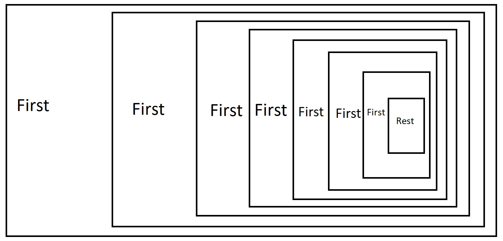

# Block 6 - Listen und Rekursion

## Programm

### Listen

Zuerst muss die Logik der Listen verstanden werden.  
Listen in Racket sind wie Ketten, die aus Gliedern bestehen. Jedes Glied kann entweder leer sein oder ein Element haben und einen Rest der Liste enthalten. Das bedeutet, dass in einer Liste immer das aktuelle Glied zu sehen ist und der Rest der Liste.

Diese Grafik zeigt das die Struktur einer Liste:



Im Textlichen sieht eine Racket-Liste so aus:

```plaintext
[1 [2 [3 [4 [5 [6 [7 [8 [9 [10 empty]]]]]]]]]]

oder:

[1 rest] (Element und Rest)
  [2 rest] (...)
    [3 rest] (...)
      [4 rest] (...)
        [5 rest] (...)
          [6 rest] (...)
            [7 rest] (...)
              [8 rest] (...)
                [9 rest] (...)
                  [10 empty] (Element und Empty)
```

#### Leere Liste

So sieht der Record für eine _leere_ Liste aus:

```racket
(define-record empty-list
  make-empty-list
  empty?) ; eig. sollte es empty-list heissen, aber es wird mit einem custom prädikat gekürzt

; custom definierung um schneller eine leere Liste zu erstellen
(define empty (make-empty-list))
```

#### Nicht-leere Liste

Eine Liste mit Elementen sieht so aus:

```racket
; Eine Cons-Liste besteht aus:
; - dem ersten Element
; - einer Liste aus Zahlen mit den restlichen Elementen
(define-record cons-list
  cons ; make-cons-list abgekürzt
  cons? ; cons-list? abgekürzt
  (first number) ; cons-first abgekürzt
  (rest  list-of-numbers)) ; cons-rest abgekürzt

; auszählung aller Listentypen
(define list-of-numbers
  (signature
   (mixed empty-list
          cons-list)))
```

##### Selektoren

Alles bis zu den Selektoren ist selbsterklärend. Die Selektoren `first` und `rest` funktionieren so, dass sie das erste Element und den Rest der Liste zurückgeben. Wenn man das zweite Element haben will, muss man den nächsten `rest` mit einem rekursiven Aufruf verwenden.

Um es wieder in Plaintext zu zeigen:

```plaintext
Liste: [1 [2 [3 [4 [5 [6 [7 [8 [9 [10 empty]]]]]]]]]]

; Erster Aufruf
(first number) ; 1
(rest list-of-numbers) ; [2 [3 [4 [5 [6 [7 [8 [9 [10 empty]]]]]]]]]

; Jetzt muss man den Rest in einen rekursiven Aufruf geben, damit 2 das "erste" Element wird.

; Zweiter Aufruf
(first number) ; 2
(rest list-of-numbers) ; [3 [4 [5 [6 [7 [8 [9 [10 empty]]]]]]]]
```

##### Signatur

Die Signatur `list-of-numbers` ist eine spezielle Signatur, die eine Liste von Zahlen oder eine leere Liste sein kann.

Eigentlich ist es eine Datendefinition und sie fügt zwei Objekte (`empty-list` was _first_ ist und `cons-list` was _rest_ ist) mit der `mixed`-Funktion zusammen.

#### Listen in Racket definieren

Leider müssen Listen genau so hässlich definiert werden, wie gezeigt.

```racket
; leere Liste
(define list0 empty) ; [empty]
; einelementige Liste mit der Zahl 42
(define list1 (cons 42 empty)) ; [42 empty]
; Liste mit den Zahlen 1 2 3
(define list2 (cons 1 (cons 2 (cons 3 empty)))) ; [1 [2 [3 empty]]]
; Liste mit den Zahlen 2 3 5 7
(define list3 (cons 2 (cons 3 (cons 5 (cons 7 empty))))) ; [2 [3 [5 [7 empty]]]]
```

#### Rekursion mit Listen

Eine Funktion ist rekursiv, wenn sie sich selbst aufruft. In Racket ist dies aufgrund der one-liner Syntax und automatischen Rückgabewerten sehr einfach.

Wir erstellen gleich ein praktisches Beispiel mit der Funktion `list-sum`, die die Summe aller Zahlen in einer Liste berechnet.

Signatur:

```racket
(: list-sum (list-of-numbers -> number))
```

Testfälle:

```racket
(check-expect (list-sum list0) 0)
(check-expect (list-sum list1) 42)
(check-expect (list-sum list2) 6)
(check-expect (list-sum list3) 17)
```

Funktion:

```racket
(define list-sum
  (lambda (list)
    (cond
      ((empty? list) 0) ; überprüfen, ob die Liste leer ist
      ((cons? list) ; überprüfen, ob es sich um eine nicht-leere Liste handelt
       (+ (first list) (list-sum (rest list)))))))
```

Die Funktion nimmt eine Liste entgegen und prüft als erstes, ob sie leer ist bzw. ob es das letzte Element ist. Wenn ja, wird 0 zurückgegeben, um es zu addieren. Wenn nicht, wird zuerst überprüft, ob es sich um eine nicht-leere Liste handelt. Dann wird das erste Element `(first list)` plus der rekursive Aufruf `(list-sum (rest list))` zurückgegeben.

Die aktuelle Liste wird mit jedem Aufruf immer kürzer, bis sie leer ist und die Zahlen nacheinander addiert werden. Die Liste wird von hinten nach vorne abgearbeitet.

Von nun an müssen die Listen, Records und deren Signaturen immer in die Skripte reinkopiert werden.

## Aufgaben

1. Listen [Link](../Tasks/6.1_Listen.md)
