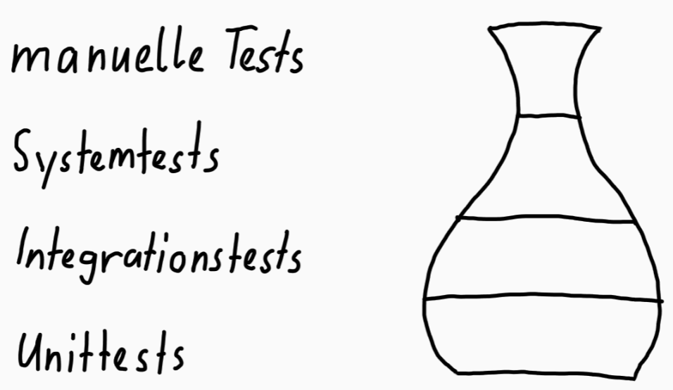

# Block 1 - Testkonzept

## Programm

### Ziel des testens

**Einstiegfrage**: Warum testen wir?

- Um Bugs zu finden und zu beheben
- Um die Funktionalität sicherzustellen
- Um zu wissen, ob Features ausversehen kaputt gemacht wurden
- Um zu wissen, keine konstanten Angstzustände zu haben

#### Warum testen wir?

##### Bugs in der Produktion sind teuer

Schwere Bugs in der Produktion sind teuer. Sie können zu Datenverlust, Umsatzeinbussen, Imageverlust und sogar zu rechtlichen Problemen führen. Das derzeit beliebte Model der heutigen Videospiele "release now fix later" ist das beste Beispiel, wie Bugs in der Produktion das Image eines Unternehmens schädigen können.

Jetzt stellt sich die Frage, warum es so viele Bugs in der Produktion gibt. Die Antwort ist einfach: Weil nicht genug getestet wird.

#### Was testen wir?

**Prioritäten setzen**:

Man kann nicht alles testen und deshalb muss man sich auf die wichtigsten Features und Anforderungen konzentrieren. Die Frage ist einfach zu beantworten: Wir testen die Features, die am häufigsten genutzt werden und die Features, die am wichtigsten sind.

**Was NICHT getestet wird**:

Es gibt Features die aus vielen Gründen nicht getestet werden. Sei es, weil es sich nicht lohnt (Testfall wird nur ein Mal gebraucht), weil es zu aufwändig ist oder weil dieser spezifische Testfall bereits in zwei separaten aufteilt wurde. Um unnötgige Fragen zu vermeiden sollte man dies klar kommunizieren und dokumentieren.

#### Teststufen und -arten

Als Erstes ist es wichtig zu wissen, dass jeder Test auch manuell ausgeführt werden kann, aber es sich (eigentlich) nicht lohnt. Deshalb werden die Tests für gewöhnlich automatisiert ausgeführt (ausser den offensichtlichen manuellen Test).

Die **Unit-Tests** sind die billigsten und schnellsten Tests. Sie testen die kleinsten Einheiten wie Funktionen und Klassen. Sie sind sehr wichtig, weil sie die Basis für alle anderen Tests sind, indem sie alle Komponententest und Features isoliert testen. Die Unit-Tests sind so schlank, dass man sie auch während der Entwicklung und nach jedem Commit ausführen kann, ohne viel Zeit zu verlieren. Die durchschnittliche Laufzeit eines Unit-Tests beträgt ein paar Millisekunden.

Die **Integrationstests** testen die Interaktion zwischen den einzelnen Komponenten, wie das testen, ob eine Datei auf dem Laufwerk erstellt wurde. Die Integrationstests kommen nach den Unit-Tests und sind entsprechend langsamer. Die durchschnittliche Laufzeit eines Integrationstests beträgt ein paar Sekunden bis zu einer Minute. Nach jedem Commit sollten sie aber nicht ausgeführt werden, weil je nach Anzahl der Tests die Laufzeit auf mehrere Minuten bis zu einer Stunde ansteigen kann. Die Empfehlung ist, die Integrationstests bei jeder Versionierung auszuführen.

**Systemtests** sind eine Art von Softwaretests, die immer für ein ganzes System (inkl. Betriebssystem) durchgeführt werden. Sie prüft, ob das System die Anforderungen erfüllt, die an es gestellt werden. Systemtests sind aussagekräftiger als Integrationstests, weil sie das System mit allen Komponenten testen, aber diese können auch wegen den banalsten Gründen, wie einem Netzwerk-Timeout, fehlschlagen. Aus diesen Gründen sollte immer eine Person die Tests überwachen. Die Systemtests werden _vor_ jedem Release durchgeführt und deren Laufzeit beträgt mehrere Stunden.

Die **manuellen Tests** sind die teuersten und langsamsten Tests. Sie werden nur bei Bedarf durchgeführt, z.B. wenn ein Kunde ein Problem meldet oder wenn ein Bug nicht automatisiert getestet werden kann. Die manuellen Tests sollten immer mit einer Prise Skepsis durchgeführt werden, weil die testende Person den Fehler vielleicht nicht zu 100 % reproduzieren kann. Ein grosser Vorteil der manuellen Tests ist, dass sie die einzigen Tests sind, die die Usability testen und zusätzliche Fehler, nach denen man nicht gesucht hat, finden können.

##### Testpyramide

Die Testpyramide ist eine gutes Fundament, um das Testen zu verstehen. Sie zeigt, dass die Unit-Tests die Basis für alle anderen Tests sind und dass die Systemtests die teuersten und langsamsten Tests sind.

##### Testvase

Die Testvase ist eine Ergänzung zur Testpyramide. Sie legt ihren Fokus mehr auf Integrationstests, da die heutigen Softwares auch mehr mit anderen Komponenten koummizieren als man isolierte Unit-Tests hat bzw. braucht.

#### Fehlerklassifizierung

##### Klassifikation

Um die Fehler richtig zu klassifizieren, kann man folgende Fragen als Stütze nehmen:

- Was ist die **Ursache**?`
  - Wenn der Fehler ausversehen oder mutwillig passiert, ist das kein schwerwiegender Fehler (normalerweise).
- Welche **Anforderungen** werden betroffen?
  - Wenn eine wichtie Anforderung, wie ein Login komplett nicht funktioniert, ist es ein schwerwiegender Fehler, aber wenn eine zweitrangige Anforderung, wie eine mangelnde Validierung bei einer Telefonnummer, nicht funktioniert, ist es ein weniger schwerwiegender Fehler.
- Wie **oft** tritt der Fehler auf?
  - Wenn der Fehler nur einmal auftritt, kann man drüber hinwegsehen, aber wenn man z.B. jedes Mal drei Fehler beim Speichern eines Eintrags bekommt, kann das nervig sein.

Dannach teilt man den Fehler in eine der folgenden **Mängelklassen** ein:

- fehlerfrei
- belanglos
- leicht
- schwer
- kritisch

##### Gewichtung

Nachdem man einen Fehler klassifiziert hat, wird ihn eine Gewichtung zugewiesen. Die Gewichtung bestimmt die Priorität des Fehlers und die Priätität bestimmt, wie schnell der Fehler behoben werden muss.

Die Gewichtung wird anhand der folgenden Punkte bestimmt:

- Feststellbarkeit (Wie einfach ist es, den Fehler zu finden?)
- Ort (wird der Abschnitt des Fehlers oft genutzt?)
- Auftretenswahrscheinlichkeit (Wie oft tritt der Fehler auf?)
- Kundenreaktion (Wie reagieren die Kunden auf den Fehler?)
- Beseitigungsaufwand (Wie aufwändig ist es, den Fehler zu beheben?)
- Abgabetermin (Wann muss die Software ausgeliefert werden?)

Ein paar Punkte sind wichtiger als andere z.B. Kundenreaktion. Man selbst als Entwickler könnte meinen der Fehler wäre fatal, aber wenn den Kunden der Fehler egal ist, kann dieser nach hinten verschoben werden; dokumentierte Fehler sollten niemals ohne fix gelöscht werden, selbst wenn diese als belangslos eingestufft werden.

Zeit ist wichtig im Leben und im Programmieren, man sollte niemals seine Zeit mit unnötigen Tasks oder Fehlern verschwenden; daher Klassifikation und Gewichtung das A und O.

## Was wir bereits haben

- Ziel des Testens (Warum, Was, Wie)
- Teststufen und -arten
- Fehlerklassifizierung

## Was wir noch brauchen

- Testumgebung
- Testinfrastruktur
- Planung
- Rollen
- Testfälle

Diese Punkte werden im nächsten Block behandelt.

## Lernziele

### Relevant für den Test

- Kennt Strategien zur Klassifizierung von Mängeln.
- Kennt Beispiele zu den verschiedenen Testarten.
- Kann Testarten nach ihren Eigenschaften unterscheiden.
- Kennt die Testpyramide und die Testvase und deren Unterschiede.

### Gut zu wissen

- Kennt den Einsatz verschiedener Testarten.
