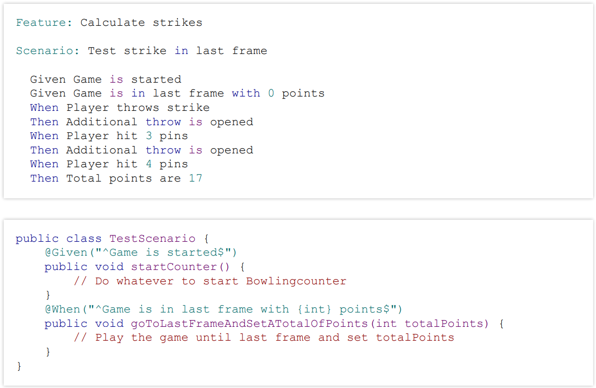

# Block 12 - Automatisierte Tests

## Programm

### Aussehen & Struktur

- TDD (Test Driven Development):
  - **A**rrange, **A**ct, **A**ssert
- BDD (Behaviour Driven Development):
  - **G**iven **W**hen **T**hen

### Given When Then

Ist weniger Technisch und Beschreibt ein Szenario. Wird bei BDD (**B**ehaviour **D**riven **D**evelopment) verwendet.  
z.B.

- **Given** the user is logged in
- **When** the clicks this button
- **Then** should this happen
  Es ist einfacher für Kundenkommunikation.

#### BDD

Von einem Kunden oder anderen Arbeiter, welcher kein Entwickler ist. Aus diesen "Anforderungen" wird Code geschrieben

- Szenario als Text
- Verbindung zum Code machen

#### Frameworks

- Cucumber
- Behave

Cucumber Beispiel:  

### Arrange, Act, Assert

Wird für Teschnisches, wie Unit-Tests verwedet und trennt die einzelnden Testphasen.

- **Arrange** Klassen und Dependencies aussetzen.
- **Act** Eigentlicher Test bzw. Testphase.
- **Assert** Erwartet und Eigentlich vergleichen.

TDD wird in späteren Blöcken genauer behandelt.
