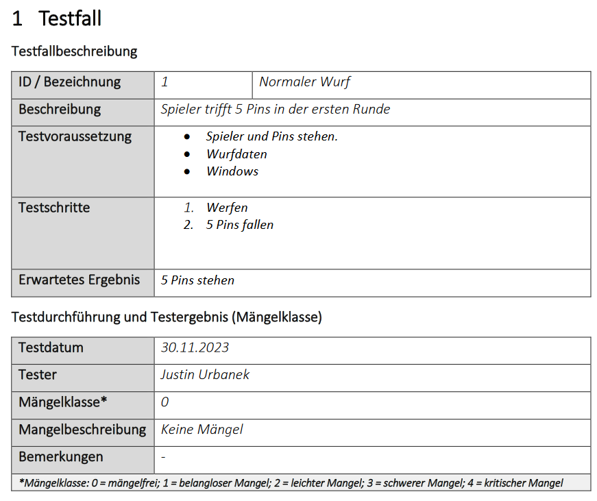

# Block 2 - Testkonzept

## Programm

Der erste Teil des Testkonzepts ist bearbeitet worden und nun werden die verbleibenden fünf Punkte bearbeitet:

- Testumgebung
- Testinfrastruktur
- Planung
- Rollen
- Testfälle

### Testumgebung

Eine Testumgebung ist ein isolierter Bereich, der speziell für das Durchführen von Tests entwickelt wurde. In einer Testumgebung kann man all seine Tests durchführen (und seine App bis an seine Limits bringen), ohne die Produktionsumgebung zu beeinträchtigen. Die Testumgebung ist eine (komplette) Kopie der aktuellsten Version der Produktionsumgebung. Die Daten sind vom der echtheit her nicht von der Produktionsumgebung zu unterscheiden, aber sie sind künstlich generiert, weil richtige Daten nicht in der Testumgebung verwendet werden dürfen (aus rechtlichten Gründen).  
Wichtig ist, dass Testdaten nicht in die Produktionsumgebung gelangen. Kein Kunde will irgendwelche offenen Rechnung von Max Musterman sehen oder Pakete zu in die Musterstrasse liefern.

Bei der Testumgebung gibt es zwei Varianten: Die interne und die externe Testumgebung.

- Die interne Testumgebung ist nur für die Entwickler zugänglich.
- Die externe Testumgebung ist für die Tester und Kunden zugänglich.

Eine Testumgebung kann ein ganzes OS sein, oder nur eine VM oder Docker Container. Es gibt keine Vorschriften, wie eine Testumgebung auszusehen hat. Wichtig ist nur, dass sie die Produktionsumgebung möglichst genau abbildet. Die Voraussetzungen für die Testumgebung sind in der Regel in den Anforderungen definiert, damit man die Testumgebung auch genau wie die Produktionsumgebung aufbauen kann.  
Je nach Testumgebung ist bestimmte Hardware (z.B. Nur Intel-Prozessoren) / Software (nur Firefox) von nöten, was dann auch in den Anforderungen definiert werden muss.

### Testinfrastruktur

Die Testinfrastruktur umfasst die gesamte Umgebung und die Ressourcen, die für das Durchführen von Tests benötigt werden. Dies beinhaltet:

#### Topologie

- Die Konfiguration und Struktur der Testumgebung, einschliesslich der Anordnung und Interaktion von Hardware und Softwarekomponenten.
- Die Verteilung von Ressourcen wie Servern, Workstations, virtuellen Maschinen und anderen Testgeräten.

#### Netzwerk

- Die Netzwerktopologie, einschliesslich der Verbindungen, Routing- und Switching-Konfigurationen, VLANs und Firewalls.
- Die Konfiguration von IP-Adressen, Subnetzen und DNS-Einträgen für die Kommunikation zwischen den Testressourcen.

#### Dateisystem

- Die Struktur und Organisation der Testdaten, einschliesslich der Speicherorte für Testskripte, Konfigurationsdateien, Protokolle und temporäre Dateien.
- Die Zugriffsrechte und Berechtigungen für Benutzer und Prozesse, um sicherzustellen, dass Tests ordnungsgemäss ausgeführt werden können.

### Planung

Beim Planen von Tests ist es wichtig, einen strukturierten Ansatz zu verfolgen. Die Planung gibt was Wann, Wo, Wer, Wie vor.
Eine Planung könnte zum Beispiel so aussehen:

#### Testfenster

Testfenster sollten so geplant werden, dass sie sich in Phasen des Entwicklungszyklus befinden, in denen Änderungen gemacht werden. Idealerweise sollten Tests frühzeitig und häufig durchgeführt werden, z.B. direkt nach einer Implementierung einer neuer Funktion.

#### Testing während des Entwicklungszyklus

Unit-Tests sollten nach jeder Änderung am Code durchgeführt werden, um sicherzustellen, dass einzelne Codeabschnitte ordnungsgemäß funktionieren und keine Regressionen auftreten. Integrationstests sollten bei jeder Versionierung durchgeführt werden und Systemtests sollten vor jedem Release durchgeführt werden. Manuelle Tests werden nur bei Bedarf z.B. Issues durchgeführt.

#### Testing nach dem Entwicklungszyklus

Jedes Wochende, wenn der Grundbettrieb nicht läuft, werden die Systemtests durchgeführt. Die Systemtests werden automatisiert und dauern mehrere Stunden. Die Ergebnisse werden am Montagmorgen ausgewertet und allfällige Fehler werden gemeldet. Diese Tests werden natürlich auf einer isolierten Testumgebung durchgeführt.

#### Testumgebung

Während der Entwicklung werden die Unit- und Integrationstests auf der lokalen Maschine ausgeführt. Mit den Releases wird eine Testumgebung erstellt, auf der auch der Kunde die Software testen und allfällige Fehler melden kann. Nach jedem Release wird automatisch eine neue Testumgebung erstellt über ein Docker Image erstellt. Die Testumgebung wird nach dem Testen wieder gelöscht.

### Rollen

Bei den Testrollen sind die Zuständig- und Verantwortlichkeiten zu definieren. Auch hier sind die W-Fragen zu beantworten.

Die gängigsten Rollen sind:

- Tester (Die Person, die die Tests durchführt; meistens derjeniege, der die Sw manuell testet)
- Testmanager (Überwacht den Testprozess und ist für die Testplanung verantwortlich)
- Testautomatisierer (Schreibt die Testskripte und automatisiert diese. Er schreibt nicht die Tests, sondern nur die Skripte)
- Entwickler (Schreibt den Code und führt die Unit-Tests durch)
- Kunde (Stellt die Anforderungen und prüft, ob die Sw den beabsichtigten Nutzen erfüllt)

Es ist wichtig den Testautomatisierer und den Entwickler in ihrer Postion zu trennen. Es ist am gänigsten, dass der Testautomatisierer nur die bereits (vom Entwickler) geschriebenen Tests automatisiert mittels Skripten oder eine Schnittstelle einfügt, dass alle Tests automatisch durchgeführt werden, wenn z.B. ein Commit gemacht wird.  
Das muss nicht immer so sein. Manchmal übernimmt der Testautomatisierer auch die Rolle des Entwicklers und schreibt die Tests selber.

Die Testrollen werden immer an das Projekt angepasst und daher kann es mehr oder weniger Rollen geben oder man neue spezifische Rollen definiert.

### Testfälle

Bevor man einen Testfall im Code schreibt, muss man sich vorher ein paar Dinge fragen. Z.B. Was will ich testen? Was ist der Sinn des Tests? Was sind die Voraussetzungen?...

Deswegen sollten die Testfälle schon beim Plannen des Projekts definiert werden. Die wichtigsten Punkte wären:

- Id (falls man die Testfälle nummerieren oder in einer Db speichern will)
- Name (kurze Beschreibung des Tests)
- Beschreibung (ausführliche Beschreibung des Tests)
- Voraussetzungen (Was muss vorhanden sein, damit der Test durchgeführt werden kann)
- Schritte bei Durchführung (Genaue Schritte, die durchgeführt / getestet werden müssen)
- Erwartetes Ergebnis (Was soll passieren, wenn der Test erfolgreich ist)
- Tatsächliches Ergebnis (Was ist wirklich passiert)
- Status (Bestanden / Nicht bestanden)

Wenn man diese Schritte befolgt und seinen Code dannach schreibt, wird man auch viel einfacher die Tests und die Doku schreiben können.

- Wichtig: Beispiele wie man Code für Testfälle und die Testfälle selbst schreibt wird in späteren Blöcken behandelt.

#### Testdurchführung

Dieser Abschnitt ist nur relevant für manuelle Tests.

Wenn man einen Test durchführt, sollte man diesen auch dokumentieren und klassifizieren. Seine Schritte beim testen einer Applikation zu dokumentieren ist auch für die Wiederherstellbarkeit des Fehlers wichtig. Hierbei ist es wichtig folgede Punkte zu dokumnentieren:

- Datum und Uhrzeit
- Wer den Test durchgeführt hat
- Testfall-Id / Name
- Welche Version der Software getestet wurde (nicht unbedingt notwendig, weil man das Datum hat, aber man kann aufversehen die falsche Version testen)
- Mängelklasse ([Fehlerklasse](./B1.md#fehlerklassifizierung))
- Mängelbeschreibung (Was ist schief gelaufen, wenn überhaupt)
- Bemerkungen (Sonstige Bemerkungen, z.B. Beobachtungen über schlechtes User-Interface)

Die Testfall-Id / Name kann man rauslassen, wenn man in seinem Testprotokoll alle Tests auflistet und die Durchführung darunter beschreibt.

- Wichtig: Die Testdurchführung und -prtokoll werden in späteren Blöcken behandelt.

## Lernziele

Dieser Lernblock ist abgeschlossen, wenn folgende Lernziele erreicht sind:

### Relevant für den Test

- Kennt die notwendigen Inhalte eines Testkonzepts
- Kennt den Aufbau eines Testfalls (z.B. Vorbedingung, Schritte, Ergebnisse)

### Gut zu wissen

- Kennt den Unterschied und die Gemeinsamkeiten einer Test- und Produktivumgebung
- Kennt Testframeworks
