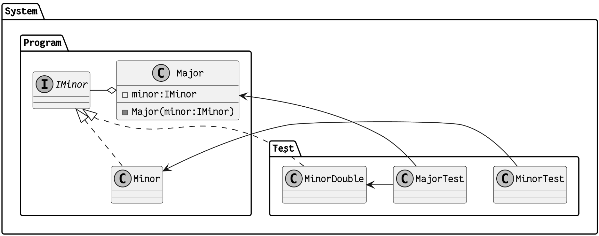

# Block 7 - Test Doubles

## Programm

Im siebten Block geht es um das Thema _Test Doubles_. Damit können einige Integrations- durch Unittests ersetzt werden. Der Übergang zum Thema _Code-Verbesserungen_ ist dabei fliessend, denn Code muss zuerst in eine passende Struktur gebracht werden, damit man Test Doubles sinnvoll anwenden kann.

## Aufgabe

### Testen mit Abhängigkeiten ist teuer

Das Testen einer Klasse mit all ihren Abhängigkeiten ist:

- **langsam**
  - Abhängigkeiten ruft externe Systeme auf (Datenbank, API, etc.)
- **aufwändig**
  - Abhängigkeiten müssen zuerst in den richtigen Zustand gebracht werden
- **schwierig**
  - Abhängigkeiten müssen zu bestimmten Verhalten gezuwungen werden

### Testen mit Abhängigkeiten ist redundant

Beispiel `Major` hat `Minor` als Abhängigkeit:

- `Minor` wird duch `MinorTest` abgedeckt (Unittest)
- `Major` wird durch `MajorTest` abgedeckt (Integrationstest)
  - `Minor` wird zweimal getestet: direkt und indirekt
  - Ist `Minor` fehlerhaft, scheitern
    - `MinorTest`, da `Minor` ja fehlerhaft ist es sinnvoll
    - `MajorTest`, obwohl `Major` korrekt arbeitet

Das ist der in vorherigen Blöcken erwähnte Nachteil von Integrationstests: die Redundanz. Das kann auch zu dem Problem führen, dass einem z.B. 30 Fehlermeldungen angezeigt werden, obwohl nur eine Handvoll Tests wirklich fehlschlagen. Daher muss es möglich sein, `Major` unabhängig von `Minor` zu testen.

Hier ist noch ein UML-Diagramm, das die Abhängigkeiten zwischen `Major` und `Minor` zeigt:  

Hier sieht man die Aggregation zwischen `Major` und `Minor`. `Major` besitzt `Minor` und ist von ihr abhängig. `Minor` ist aber nicht von `Major` abhängig. Das ist ein typisches Beispiel für eine Abhängigkeit, die nicht zwingend ist. `Major` kann auch ohne `Minor` existieren, aber `Major` kann nicht ohne `Minor` getestet werden.

Mehr über Aggregation und Komposition weiter unten.

#### Komposition, Aggregation

Bevor das obige Problem gelöst werden kann müssen die Begriffe _Komposition_ und _Aggregation_ geklärt werden.

Die **Aggregation** ist eine Form von Beziehung, bei der eine Klasse andere Klassen enthält, ohne dass die enthaltenen Klassen notwendigerweise von der enthaltenden Klasse abhängig sind. Z.B. Ein Tisch besteht aus einer Tischplatte und Tischbeinen, aber die Tischbeine können auch ohne einen Tisch verwendet werden. Eine Aggregation wird in einem UML-Diagramm durch eine offene Raute an der besitzenden Seite gekennzeichnet.

Die **Komposition** ist eine Form von Beziehung, bei der eine Klasse andere Klassen enthält, und die enthaltenen Klassen von der enthaltenden Klasse abhängig sind. Z.B. Ein Gebäude besteht aus Räumen, aber die Räume können nicht ohne das Gebäude existieren. Eine Komposition wird in einem UML-Diagramm durch eine gefüllte Raute an der besitzenden Seite gekennzeichnet.

### Test Doubles

Das Problem kann mit sogenannten _Test Doubles_ gelöst werden. Das sind Klassen, die die Abhängigkeiten ersetzen und exklusiv im Testcode geschreiben werden. Der Produktivcode wird nicht verändert und nicht im Testcode verwendet oder ausgeführt. In diesem Fall wird `MajorTest` nun `MinorDouble` verwendet, anstatt `Minor` direkt. `MinorDouble` ist eine Klasse, die nur für den Test geschrieben wird und die Abhängigkeit zu `Minor` ersetzt. `MinorDouble` kann so programmiert werden, dass sie die Abhängigkeit zu `Minor` simuliert und keinen äusseren Einfluss hat.

Jetzt testet `MajorTest` nur den Produktivcode von `Major` und wird damit zu einem Unittest.

**Warum das ganze überhaupt?**

1. Eigentlich wollen soll nur `Major` bzw. dessen Logik (nicht die Seiteneffekte) getesten werden.
2. z.B. Wird wollen nicht wiessen, ob der POST-Reqeust an die API funktioniert, sondern nur, ob die (theoretisch) richtigen Daten an die API gesendet werden.
3. Deswegen ist `MinorDouble` perfekt, da es nur die Logik von `Minor` simuliert und nicht die Seiteneffekte

- heisst im Beispiel von oben würde kein POST-Request erstellt werden

Es gibt verschiedene Arten von Test Doubles:

### Wie die reale Umsetzung funktioniert

1. Abhängigkeiten können mittels Interfaces entkoppelt werden
2. Abhängigkeiten werden per Konstruktor mitgegeben
3. Alternative Abhängigkeiten implementieren (Test Doubles)

#### Dependency Injection

1. `Major` erwartet eine `Minor`-Implementierung als Parameter im Konstruktor
2. Bei `Minor` wird ein Interface verwendet, welches bei `Major` verwendet wird
3. `MinorDouble` muss das Interface auch implementieren

Das sieht dann so aus:

**Produktivcode - Program**
Vorher hatte `Major` eine direkte Aggregation zu `Minor`. Jetzt hat `Major` eine Aggregation zu einem Interface (`IMinor`), das von `Minor` implementiert wird. Die `Major` Klasse hat einen Konstruktor, der eine Instanzierung von `IMinor` erwartet; heisst es erwartet eine Klasse, die `IMinor` implementiert.

**Testcode - Test**
`MinorDouble` ist der `TestDouble` und genau wie das Original `IMinor` implementiert. Der `MajorTest` Implementiert nun `MinorDouble` und nicht mehr `Minor`. Der `MinorTest` bleibt unverändert.

`Major` und `Minor` sind entkoppelt. `Major` ist nun nicht mehr von `Minor` abhängig, sondern nur noch von dem Interface. `Major` kann nun mit jeder Klasse arbeiten, ohne dass diese von `Minor` abhängig ist. Das ist die Grundlage für Dependency Injection.

##### Bespiele Testing Frameworks / Libraries

Testingframeworks und Libraries bieten oft schon fertige Test Doubles und weitere Hilfsmittel an. Hier sind ein paar Beispiele:

- Java: [Mockito](https://site.mockito.org/)
- C#: [Moq](https://github.com/devlooped/moq/)
- Python: [unittest.mock](https://docs.python.org/3/library/unittest.mock.html)
- JavaScript: [Mocha](https://mochajs.org/)

### Arten von Test Doubles

Wenn man eine Dependency Injection verwendet, gibt es verschiedene Arten, wie man seine Test Doubles definieren kann.

#### Dummy (Platzhalter)

Ein Dummy ist die einfachste Form eines Test Doubles. Einen Dummy kann man immer brauchen, wenn man für eine Abhängigkeit etwas weitergeben muss, aber man weiss schon, dass man die Abhängigkeit nicht braucht.

##### Beispiel

TBA

#### Fake (vereinfachte Implementierung)

Ein Fake hat vereinfachte Programlogik implementiert, welche das Produktivsystem simuliert. Ein Fake ist eine gute Wahl, wenn die echte Implementierung zu komplex ist, um sie im Test zu verwenden.

##### Beispiel

TBA

#### Stub (vordefinierte / hard-coded Antworten)

Eine Pseudo-Implementierung, die vordefinierte Antworten zurückgibt. Ein Stub ist ein bischchen wie ein Fake nur mit vordefinierten Antworten anstatt mit vereinfachter Logik. Stubs ignorieren konsequent alle Eingaben / Parameter und geben immer die gleiche Antwort zurück.

Der Sinn des Stubs ist es auf einen Prozess zu verzichten, der für den Test nicht relevant ist und vordefinierte Antworten, welche für den Test relevant sind, zurückzugeben. Einfach gesagt: Der Prozess wie man zu den Antworten ist egal, die Antworten sind wichtig.

##### Beispiel

TBA

#### Mock (Stub mit "Erinnerungsfunktion")

Ein Mock ist ein erweiterter Stub. Der gibt vordefinierte Antworten zurück, aber kann ich merken welche Methoden wie oft aufgerufen wurden.

##### Beispiel

TBA

#### (Spy) (Wrapper für echte Objekte)

Ein Spy ist kein traditonelles Test Double, da man auch Produktivcode damit getestet werden kann. Der Spy legt sich als Wrapper um eine Abhängigkeit herum und leitet alle Aufrufe an das originale Objekt weiter und so kann man das Objekt überwachen. Das ermöglichst den bei genaue Informationen über das Objekt aufzuzeichnen (Aufrufe, Parameter, Rückgabewerte, etc.).

##### Beispiel

TBA

## Aufgaben

## Lernziele

### Relevant für den Test

- Kennt Möglichkeiten zum Umgang mit Abhängigkeiten (z.B. Interfaces, Injection, Mock, Spy, Stub, Dummy, Fake, Fixtures).

### Gut zu wissen

- Kennt Testframeworks und Libraries
